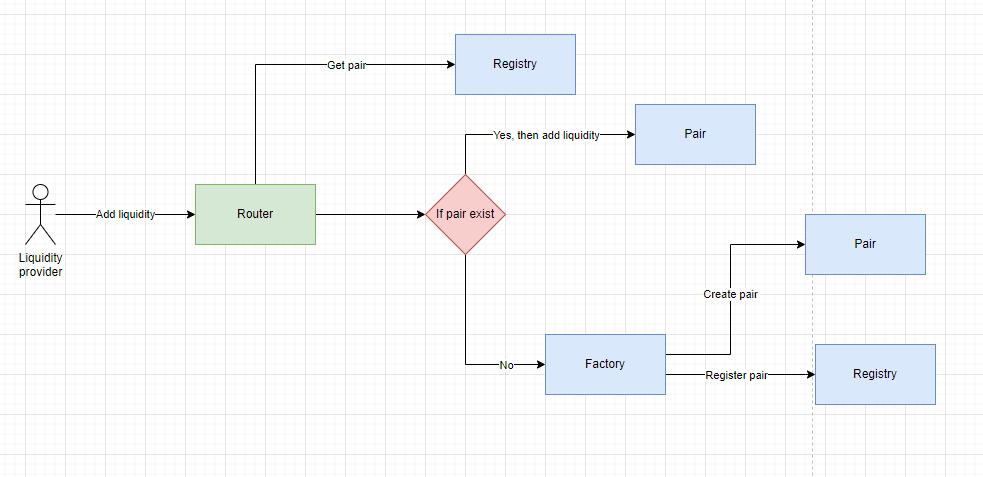
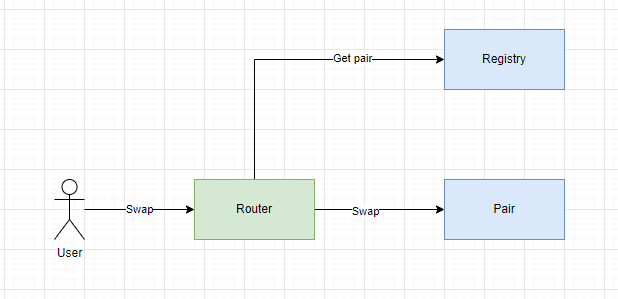

# DEX

**DEX**(Decentralized exchange) - децентрализованный обменник. Управление и администрирование такого сервиса не принадлежит никому или находится в руках сообщества. Доступ к активам осуществляется без помощи посредника, поэтому такой обменник можно назвать [одноранговым](https://academy.binance.com/en/glossary/peer-to-peer) или P2P.

Подобного рода протоколы, позволяют создавать пулы ликвидности и наполнять их токенами, чтобы пользователи могли обменивать(торговать) токены. Базой для ценообразования активов выступает алгоритм **AMM**(automated market maker).

## TЗ

1. Необходимо реализовать протокол DEX, который позволит:
    - Создавать пулы ликвидности. Пул будет состоять из двух токенов стандарта ERC-20.
    - Добавлять и удалять ликвидность.
    - Проводить обмен одного ERC-20 токена на другой с учетом проскальзывания.
2. Необходимо реализовать систему создания новых пар.
3. Необходимо реализовать систему сбора комиссий для протокола.

## Контракты для реализации:

- **Router** - смарт-контракт для взаимодействия пользователей с протоколом. Позволяет добавлять и удалять ликвидность к любой созданной паре токенов, позволяет обменивать один токен на другой.
- **Pair** (пул) - смарт-контракт, который является ERC-20 токеном(LP токен). Хранит резервы токенов. Будет отражать доли участников пула.
- **Registry** - смарт-контракт, который будет хранить актуальный список задеплоенных пар.
- **Factory** - смарт-контракт, который деплоит новую пару, создает запись о ней в смарт-контракте **Registry**.
- **Fee** - смарт-контракт, который отвечает за информацию по комиссиям протокола.
    - Комиссия за свопы: установка, обновление значения
    - Комиссия протокола: установка, обновление значения, хранение LP токенов.

## Как это выглядит для поставщика ликвидности

Поставщик через вызов смарт-контракта **Router** добавляет ликвидность. Если пара не была зарегистрирована на контракте **Registry**, то вызов контракта **Factory** создает новый контракт **Pair**. **Factory** должна передать контракту **Pair** при создание адрес контракта **Fee**. После создания пары, **Factory** регистрирует пару на контракте **Registry**.

_Важно_ Удаление ликвидности(remove liquidity) работает по такой же схеме, как и добавление ликвидности, если нужная пара существует и ликвидность была добавлена.

Любой поставщик ликвидности может:
- Создать новую пару токенов, если она не была создана. Первый депозит должен задать начальный курс между парой токенов. Курс может быть каким угодно.
- Добавить ликвидность. Взамен поставщик получает lp токены.
- Забрать ликвидность. Сжечь lp токены через протокол и забрать свою ликвидность(оба токена) с вознаграждением. Например, пул содержит 100 USDT и 200 shitCoin. Согласно количеству lp токенов, доля поставщика равняется 10%. Соответственно, он получит 10 USDT и 20 shitCoin + вознаграждение за предоставление ликвидности.
- Передать lp-токены третьему лицу. Это будет означать, что поставщик передал права на долю своей ликвидности в пуле.

## Вознаграждение за предоставление ликвидности

С каждым обменом общая ликвидность пула растёт. То есть протокол взимает комиссию с каждого обмена. Поэтому стоимость доли поставщика тоже растет. Например,
- у поставщика 10% доля в пуле, всего в пуле 1000 USDT + 1000 DAI, значит ему принадлежит 100 USDT + 100 DAI.
- пользователь делает обмен 200 USDT -> 200 DAI, но протокол удерживает комиссию 5 DAI и пользователь получает 195 DAI
- после обмена в пуле 1200 USDT + 805 DAI (общая ликвидность увеличилась), значит поставщику теперь принадлежит 120 USDT + 80.5 DAI при этом доля в процентах никак не изменилась, она осталась 10%, но в перерасчете на токены доля увеличилась.

## Как это выглядит для пользователя

Пользователь вызывает функцию **swap** на контракте **Router**. **Router** проверяет регистрацию пары на контракте **Registry**. Если пара была зарегистрирована, то производит **swap** и обновляет информацию о резервах на контракте **Pair**.

У пользователя должна быть возможность выполнить два вида обмена:
- Пользователь указывает сумму токена, которую он отдает протоколу. Взамен, протокол рассчитывает сумму второго токена, которую можно отдать пользователю. Протокол производит обмен.
- Пользователь указывает сумму второго токена, которую он хочет получить из протокола. Взамен, протокол рассчитывает сумму первого токена, которую пользователь должен отдать. Протокол производит обмен.

## Как это выглядит со стороны контрактов

### Шаг первый:

Деплой контрактов:
- **Router**
- **Pair**
- **Registry**
- **Factory**
- **Fee**

### Шаг второй:

- Устанавливаем на контракте **Router** адрес контракта **Registry**. Чтобы получать адрес контракта **Pair**.
- Устанавливаем на контракте **Factory** адреса контракта **Registry**.
- Устанавливаем на контракте **Registry** адрес контракта **Factory**. Только контракт **Factory** должен уметь записывать адреса пар.

### Шаг третий:

- Контракты готовы к использованию, тестируем все основные операции:
    - добавление и удаление ликвидности
    - обмены
    - списание комиссий
    - сохранение правильного соотношения торгуемых пар

## Функционал смарт-контракта Router:

**Router** может добавлять и удалять ликвидность в пары, для этого ему нужно знать адрес **Registry**, чтобы получить нужную пару.

Необходимо реализовать функции:
- `addLiquidity`
- `removeLiquidity`

**Router** может производить обмен ERC-20 токена на ERC-20 токен.
Необходимо реализовать функции:
- `swapIn(tokenA, tokenB, amountIn, amountOutMin) returns (amountOut)`.
    - Обмен **tokenA** на **tokenB**.
    - **amountIn** - это сумма **tokenA**, которую пользователь готов обменять на **tokenB**.
    - **amountOutMin** указывает минимальное количество **tokenB**, которое пользователь согласен получить.
- `swapOut(tokenA, tokenB, amountOut, amountInMax) returns (amountIn)`.
    - Обмен **tokenA** на **tokenB**.
    - **amountOut** - это сумма **tokenB**, которую пользователь хочет получить.
    - **amountInMax** указывает максимальное количество **tokenA**, которое протокол может списать с пользователя.
- `getAmountOut(amountIn)` - эта функция должна возвращать количество **tokenB**, если к обмену будет предложено **amountIn**.
- `getAmountIn(uint amountOut)` - эта функция должна возвращать количество **tokenA**, которое необходимо, чтобы получить **amountOut** для **tokenB**.

_Важно!_ Обе функции делают обмен **tokenA** на **tokenB**, и должны возвращать результат обмена(сколько пользователь в итоге получил **tokenB** или сколько отдал **tokenA**).

## Ответственность смарт-контракта Factory:

- Создает новый контракт Pair для новой пары токенов. Использовать паттерн [minimalProxy](https://docs.openzeppelin.com/contracts/3.x/api/proxy#Clones).
- Регистрирует новую пару через вызов контракта **Registry**

## Ответственность смарт-контракта Registry:

- Регистрирует новую пару. Записывает адрес контракта **Pair**. Вызов разрешен только доверенным адресам. Использовать [Access control](https://docs.openzeppelin.com/contracts/3.x/access-control).
- Функция `getPair(tokenA, tokenB)` обязательна для получения адреса контракта **Pair**.

## Ответственность смарт-контракта Pair:

Контракт является ERC-20 токеном. Это необходимо для начисления lp токенов поставщикам ликвидности.

- `mint()` - Минтит lp токены, когда поставщик добавляет ликвидность.
- `burn()` - Сжигает lp токены, когда поставщик забирает ликвидность.
- `swap()` - Производит непосредственный обмен токенами. Обновляет информацию о резервах токена.
- Знает о смарт-контракте **Router**. Только **Router** может вызывать `mint()`, `burn()`, `swap()`

## Ответственность смарт-контракта Fee:

_Важно!_ Swap fee должно быть реализовано внутри смарт-контракта **Router**. Fee должно быть незамедлительно начислено в резервы пула ликвидности. Приветствуется использование библиотеки, для реализации получения и расчета swap fee. То есть отделение логики расчетов от основного контракта в собственную библиотеку.

Смарт-контракт **Fee** должен иметь возможность включать и выключать сбор комиссий с протокола. Сбор взимается с общей доли поставщиков ликвидности. Таким образом любой обмен, увеличивает резервы в пуле и увеличивает долю владения контракта **Fee**. То есть, когда поставщику ликвидности минтятся lp токены, часть из них должна минтиться для контракта **Fee**. На контракте **Fee** должна быть возможность обменять lp токены на настоящие токены пары или передать право владения lp токенами.

Смарт-контракт **Fee** должен:
1. Регулироваться [Access control](https://docs.openzeppelin.com/contracts/3.x/access-control).
2. Устанавливать размер fee не больше максимального 0.2%. 0.3% должно взиматься с каждого обмена.

## Дополнительный функционал, который можно реализовать

1. Поддержка сложных путей, когда прямой своп не возможен из-за отсутствия нужной пары, но можно реализовать возможность передать маршрут обмена. Функция должна автоматически выполнить обмен согласно маршруту через другие пары.

_Важно!_ Считаем, что оптимальный маршрут рассчитывается off-chain. И смарт-контракты работают с этим маршрутом, делая обмены.

2. Добавление ликвидности в виде пары ETH - ERC-20.
3. Обмен ETH на токен ERC20 и обратно.

## Требования к выполнению задания

- Полное покрытие контрактов unit тестами, в том числе в режиме форка сети (mainnet, testnet)
- Написание интеграционных тестов, которые позволят протестировать протокол на взаимодействие между контрактами на группе пользователей. Например, симулировать: создание пары, добавление ликвидности, обмены разными пользователями, снятие ликвидности, проверка вознаграждения.
- Скрипты деплоя, которые развернут протокол в тестовую сеть с верификацией смарт-контрактов.
- Документация и описание всех публичных функций по natspec.
- Должна быть продумана система событий. Для всех функций(где необходимо) должен быть реализован emit событий.

Безопасность:

- Модификаторы `ReentrancyGuard` и `Ownable` можно взять из OpenZeppelin.
- Модификаторы `onlyFactory` и `onlyRouter` делаются по подобию `onlyOwner`.

_Важно!_ В любом случае использование надежных контрактов от openZeppelin, которые прошли аудит приветствуется.

### Полезные ссылки

Протокол Uniswap V2 может быть полезным.

- [Uniswap docs](https://docs.uniswap.org/)
- [Core](https://github.com/Uniswap/v2-core)
- [Periphery](https://github.com/Uniswap/v2-periphery)